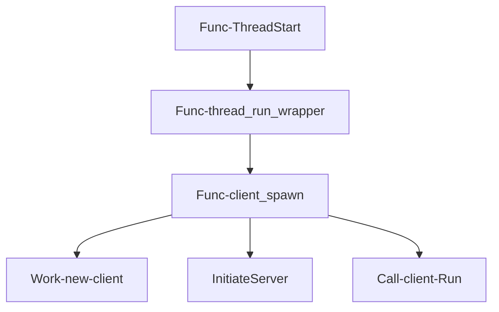

# Iperf客户端模工作流

```mermaid
graph TD;
    Func-ThreadStart-->Func-thread_run_wrapper;
    Func-thread_run_wrapper-->Func-client_spawn;
    Func-client_spawn-->Work-new-client;
    Func-client_spawn-->InitiateServer;
    Func-client_spawn-->Call-client-Run;
```
